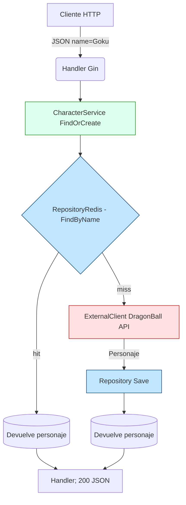

# go-dragonball

**go-dragonball** es una mini-API REST escrita en Go que funciona como un “Pokédex” de _Dragon Ball_.  
Cuando llega un nombre de personaje:

1. Busca primero en Redis (cache/hach).  
2. Si no está, consulta la _Dragon Ball API_ pública.  
3. Guarda el resultado en Redis y lo devuelve al cliente.

El proyecto sigue un mix **arquitectura Clean / Hexagonal**:


---

## Contenido del repo

| Ruta | Propósito |
|------|-----------|
| `cmd/api/main.go` | Arranca servidor Gin y hace _wiring_ de dependencias |
| `internal/character/service.go` | Caso de uso `FindOrCreate` |
| `internal/character/repository.go` | Interfaces **CharacterRepository** / **ExternalClient** |
| `internal/character/redis_repository.go` | Adaptador Redis |
| `internal/character/client_dg.go` | Cliente HTTP a la Dragon Ball API |
| `internal/character/handler/gin/` | Handler REST |
| `Dockerfile` + `docker-compose.yml` | Contenedores app + Redis |

---

## Requisitos

* **Docker 20+** y **docker-compose v2** (probado en Docker Desktop)
* (opcional) **Go 1.24** si quieres correr sin Docker

---

## Cómo arrancar

```bash
# 1. Clonar
git clone https://github.com/cuchodechile/go-dragonball.git
cd go-dragonball

# 2. Construir y levantar
docker compose up --build -d

# 3. Probar 
# POST (JSON) — crea / devuelve personaje
curl -X POST http://localhost:8080/characters \
     -H "Content-Type: application/json" \
     -d '{"name":"Goku"}'

# 5. Revisar 
docker compose logs -f go-dragonball
# o sacar datos de redis
docker exec -it op-redis redis-cli --scan
```




